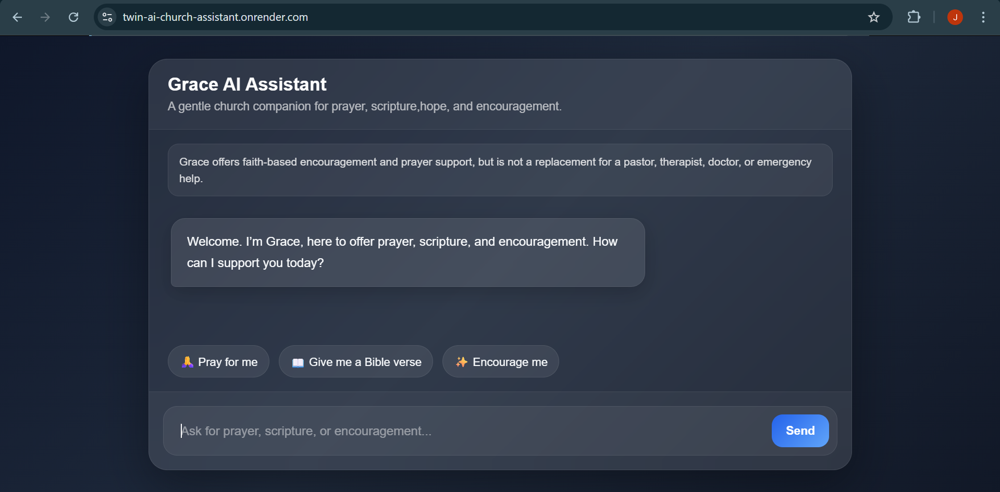
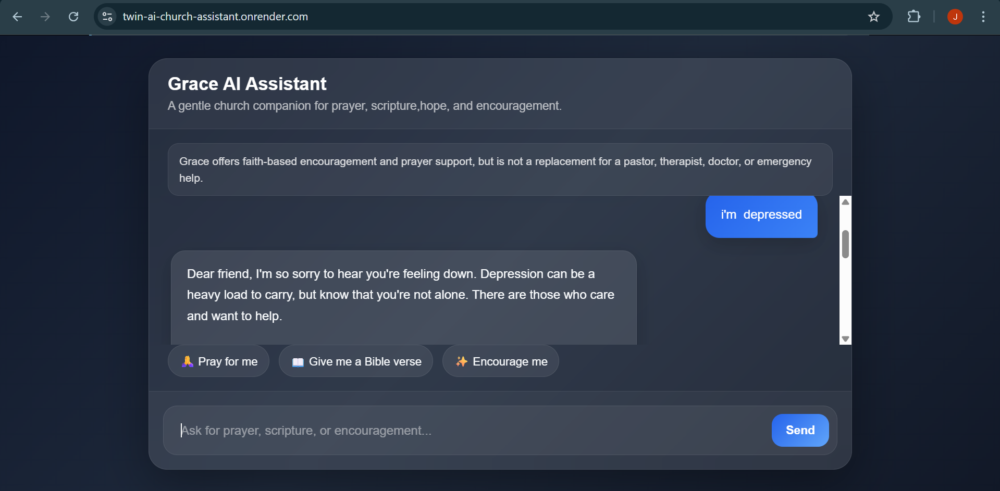

# Grace AI Assistant

Grace AI Assistant is a faith-based AI web application designed to offer prayer, scripture, and encouragement through a calm and supportive church-centered experience.

## Preview

## Features

- Prayer support
- Bible-based encouragement
- Scripture-focused quick actions
- Clean modern chat interface
- Typing indicator
- Conversation memory during runtime
- Live deployment on Render

## Built With

- HTML
- CSS
- JavaScript
- Node.js
- Express
- Groq API
- Render

## Project Purpose

This project was built to explore how AI can be used in a faith-centered setting to provide gentle encouragement, scripture reflection, and guided support through a polished web experience.

## Quick Actions

The assistant includes guided actions such as:

- Pray for me
- Give me a Bible verse
- Encourage me

These make the product easier to use and help communicate its purpose clearly.

## Safety Note

Grace AI Assistant is designed for spiritual encouragement and prayer support. It is not a replacement for a pastor, therapist, doctor, or emergency assistance.

## Live Demo

[View Live App](https://twin-ai-church-assistant.onrender.com)

## What I Learned

While building this project, I learned how to:

- Build and deploy a full-stack AI application
- Connect a frontend chat UI to a backend AI API
- Manage project version control with Git and GitHub
- Debug deployment issues across local, GitHub, and production environments
- Improve product design through guided quick-action features

## Future Improvements

- Persistent user memory
- Bible verse API integration
- Better session management
- More guided support flows
- Enhanced UI animations and polish
